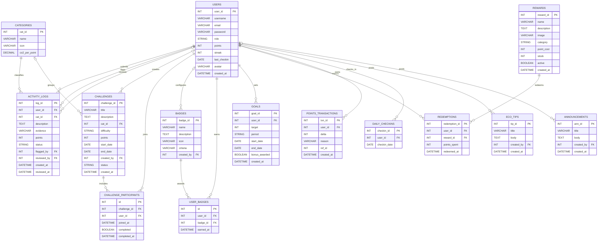

# EcoTrack Entity Relationship Diagram

The diagram below reflects the current database structure defined in `ecotrack.sql`.

## Relationship Notes

- `activity_logs.flagged_by` and `activity_logs.reviewed_by` both reference `users.user_id`.
- `challenge_participants` stores each join record and whether the challenge has been completed.
- `user_badges` resolves the many-to-many relationship between users and badges.
- `points_transactions.ref_id` is a reference marker used by the app logic. It is not enforced as a database foreign key because it may point to different business events.
- `challenges.cat_id` is optional, so a challenge can exist without a category, although the current challenge forms encourage category-based challenges.
