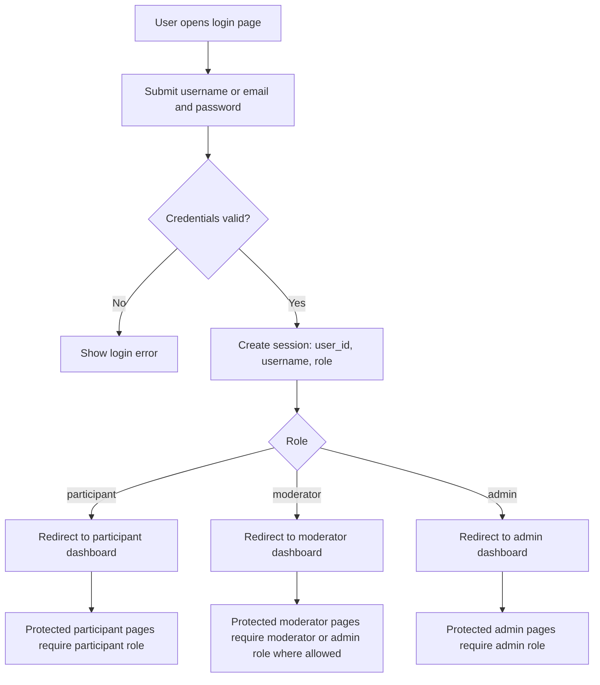
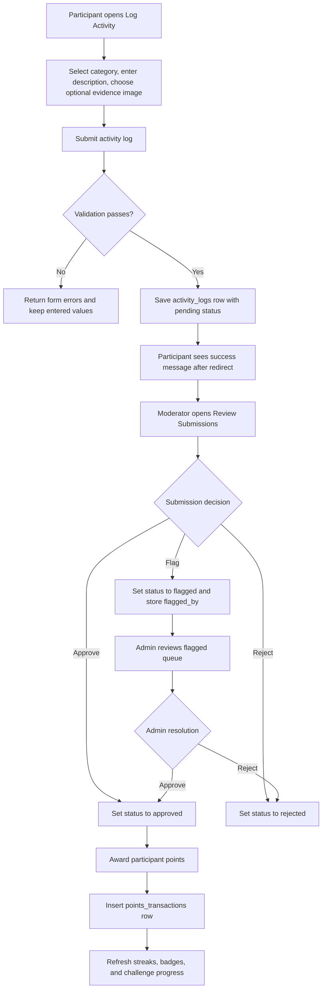
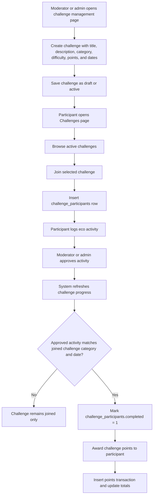
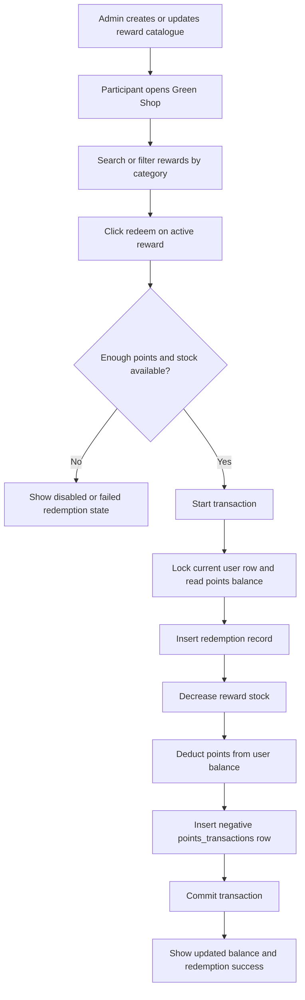

# EcoTrack Flowchart

This document summarizes the main live system processes in the current EcoTrack application.

## 1. Authentication And Role Redirect

## 2. Participant Activity Submission And Review

## 3. Challenge Creation, Participation, And Completion

## 4. Reward Redemption And Points Deduction

