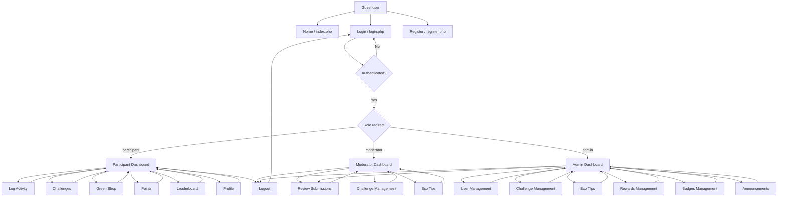

# EcoTrack Navigation Map

This site map reflects the current role-based navigation structure of the EcoTrack web application.

## Guest Navigation

- Home
- Login
- Register

## Participant Navigation

- Dashboard
- Log Activity
- Challenges
- Green Shop
- Points
- Leaderboard
- Profile
- Logout

## Moderator Navigation

- Dashboard
- Review Submissions
- Challenges
- Eco Tips
- Logout

## Admin Navigation

- Dashboard
- Users
- Challenges
- Eco Tips
- Rewards
- Badges
- Announcements
- Review Submissions through moderator review workflow where permitted
- Logout

## Access Rules

- Guests can only access public pages.
- Participants are redirected to the participant dashboard after login.
- Moderators are redirected to the moderator dashboard after login.
- Admins are redirected to the admin dashboard after login.
- Protected pages use role checks from `includes/auth.php`.
